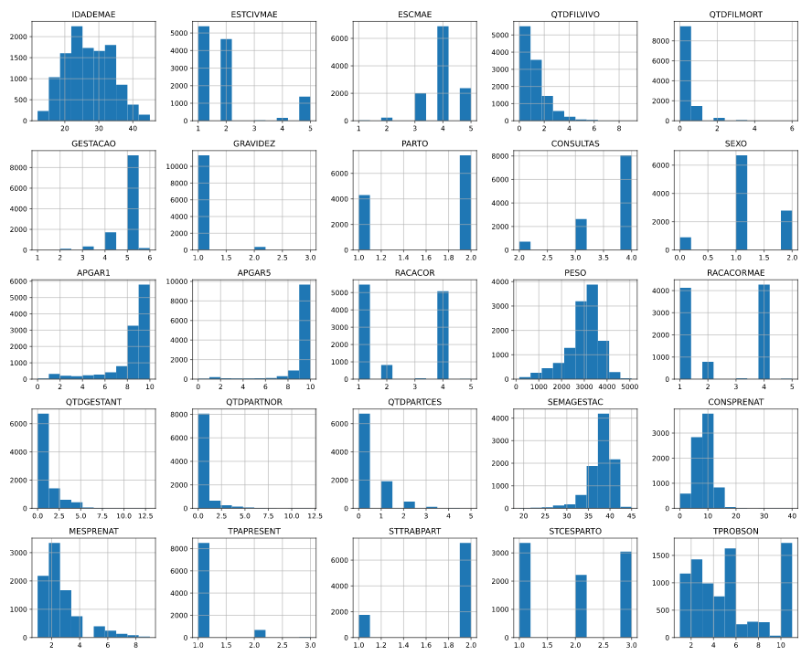
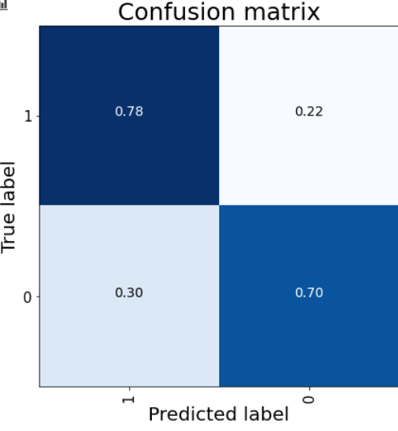
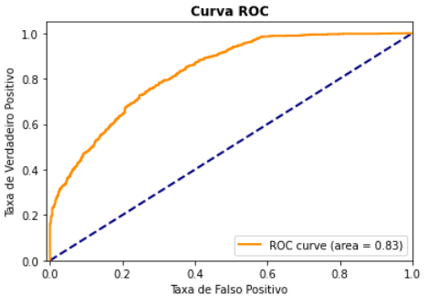
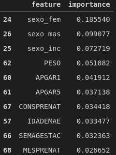
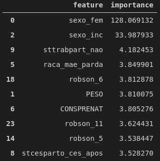

# Análise dos resultados

## Histograma da distribuição dos dados
Histograma dos dados utilizados na modelagem

## Matriz de Confusão
Matriz de confusão avaliada no conjunto de teste

## Curva ROC
Curva ROC avaliada no conjunto de teste

## Importância das Features
Importância das features de entrada segundo o algorítimo escolhido pelo AutoML e segundo o XGBOOST

* AutoML Best Model

* XGBOOST

